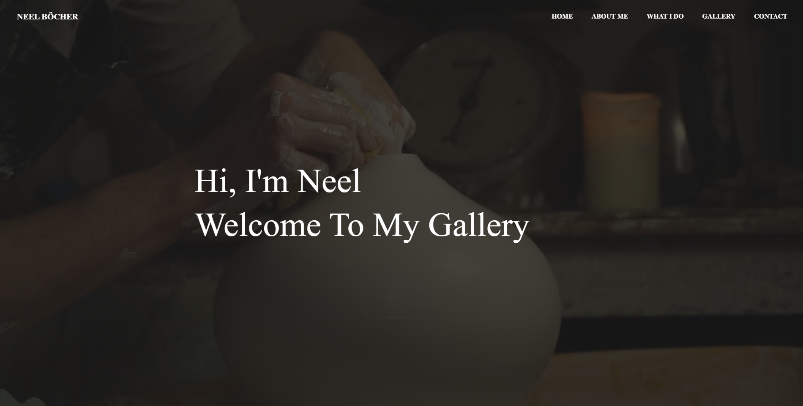
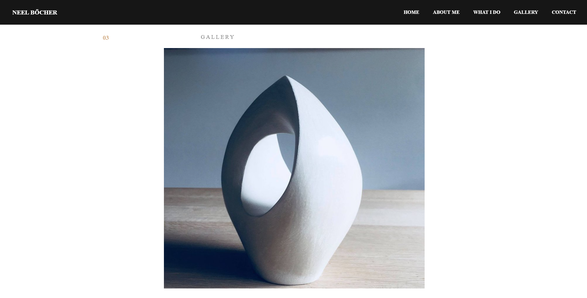

# Art-gallery
A very modern Art Gallery to showcase the client’s art and hopefully promote the business. The website is a highly functional single-page website with beautiful design that differentiates itself from conventional gallery pages. The back-end of the website is written in Python using the framework Django. The front-end is written using pure CSS and JS for animations. Configured for Heroku deployment. Working on configuring the website for AWS's RDS & S3 Buckets in the near future.

